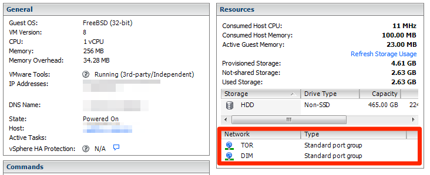

As a fun project, and to experiment a bit more with VLANs and my new router, I decided to setup a new "Public" Wifi off of our home Internet connection.  Because I don't want to be particularly careful what traffic I allow through, I decided force all of it through [TOR][tor] so that it can't come back to me (as a bonus this also effectively rate limits clients).  

Roughly this is what I had in mind:


## Network Setup ##

I use VMware to house a lot of my home infrastructure so, within VMware, I create two new virtual networks:

1. **DIM** - The internet facing side.  This is tied to a separate connection on the firewall and has no access to internal networks.  This is tied to the firewall which allows traffic from this network to reach the Internet but nothing else...
1. **TOR** - "Public" network.  Traffic from this network is given access to the Internet but ALL traffic is routed through TOR first.  This network was assinged VLAN 100 on a NIC so that I can attach the Wifi router to it.

Both of the above networks will be attached to the gateway/TOR machine.


The WIFI router ([D-Link DAP-2310][dlink]) was configured to have multiple SSIDs (Internal network, Guest network and Public (TOR) network on separate VLANs).


Finally the rules for the "DIM" network were setup in pfSense so that it has access to the Internet and no route to any internal networks.  (pfSense rules are backwards from how I think and are written against the originating interface instead of the recipient interface).  Note that "TOR" network is not known by the firewall since all TOR traffic is NAT'd through the proxy machine.


## Proxy / Gateway Server Setup ##

The base system is OpenBSD 5.4 running within VMware.  I chose OpenBSD because it's base system is very solid and doesn't include a lot of extras.  I want this as stripped down and bullet proof as possible.

I did a stock install on a tiny 5GB VM image (OpenBSD doesn't need a lot), and gave it 256M of ram.   I left SSH and all other network services turned off.  If I need to administer this I can use VMware console.

I installed the TOR package from the OpenBSD 5.4 package repository.

Ethernet devices for this host are:

* em0 - tied to DIM (Internet side)
* em1 - tied to TOR ("Public" side)



After that, it's just a matter of tweaking configuration, a quick reboot, and some testing to verify that the rules are correct and that traffic on "Public via. TOR" is routed through TOR as expected.

### /etc/hostname.em0 ###

em0 (VLAN DIM) uses DHCP

```
dhcp
```

### /etc/hostname.em1 ###

em1 (VLAN TOR) uses static IP address of 10.10.10.1.  It will be handing out IPs to guests on this subnet.

```
inet 10.10.10.1 255.255.255.0 NONE -inet6
```

### /etc/tor/torrc ###

I add the following to my torrc to turn on transparent proxying and DNS handling.

```
AutomapHostsOnResolve 1
DNSPort 53
TransPort 9040
```

### /etc/rc.conf ###

Modify startup to bring up TOR on system boot.

```
/usr/local/bin/tor -f /etc/tor/torrc
```

### /etc/sysctl.conf ###

Enable NAT on OpenBSD box...

```
net.inet.ip.forwarding=1	# 1=Permit forwarding (routing) of IPv4 packets
net.inet.ip.mforwarding=0	# 1=Permit forwarding (routing) of IPv4 multicast packets
net.inet6.ip6.forwarding=0	# 1=Permit forwarding (routing) of IPv6 packets
net.inet6.ip6.mforwarding=0	# 1=Permit forwarding (routing) of IPv6 multicast packets
net.inet6.ip6.accept_rtadv=0	# 1=Permit IPv6 autoconf (forwarding must be 0)
```

### /etc/pf.conf ###

This was heavily borrowed from this article on [Creating an Anonymization Gateway with Tor and OpenBSD 4.9](http://sickbits.net/creating-an-anonymization-gateway-middlebox-with-tor-and-openbsd-4-9/).

```
# declare network variables
em1_net = "{ 10.10.10.0/24 }"

set loginterface em1
set ruleset-optimization basic
set skip on lo
antispoof for em0
set reassemble yes
set optimization normal

# default deny policy - Deny All Traffic By Default. 
block in on em0 all
block in on em1 all

# Tor transparent proxy settings - Here's the IMPORTANT Tor stuff!!
# All TCP traffic and DNS traffic only.  
pass in quick on { em1 } proto tcp rdr-to 127.0.0.1 port 9040
pass in quick on { em1 } proto udp rdr-to 127.0.0.1 port 53

# --[[NAT Translation]]-- NECESSARY!!!!
# Here PF translates all packets from our 3 networks to the IP address of fxp0 so they're
# internet routable. The parentheses around fxp0 says to evaluate the current IP assigned to the interface.
# To view active NAT translations "pfctl -s state"
pass out on em0 from { $em1_net } to any nat-to (em0)

# Normal traffic - Pass all traffic out of fxp0 (to WAN) after translation
pass out on em0 from (em0) to any modulate state
```

### /etc/dhcpd.conf ###

Configuration for DHCP server.  This will be handing out IPs on em1 TOR VLAN (10.10.10.0/24).

DNS dumped through Google's 8.8.8.8 (although that is also tunneled through TOR).

```
subnet 10.10.10.0 netmask 255.255.255.0 {
	option routers 10.10.10.1;
	range 10.10.10.100 10.10.10.200;
	option domain-name-servers 8.8.8.8;
}
```

### /etc/rc.local.conf ###

Turn on the DHCP server on em1 (TOR VLAN).

```
dhcpd_flags="em1"
```


[tor]: https://www.torproject.org/
[dlink]: http://www.dlink.com/ca/en/business-solutions/wireless/access-points/access-points/dap-2310-airpremier-n-high-port-access-point

