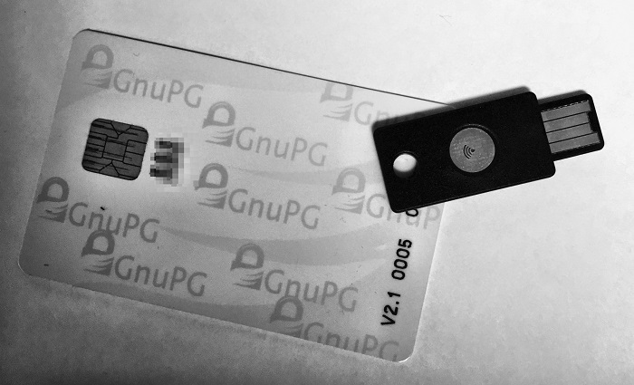
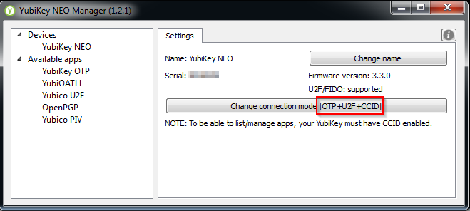
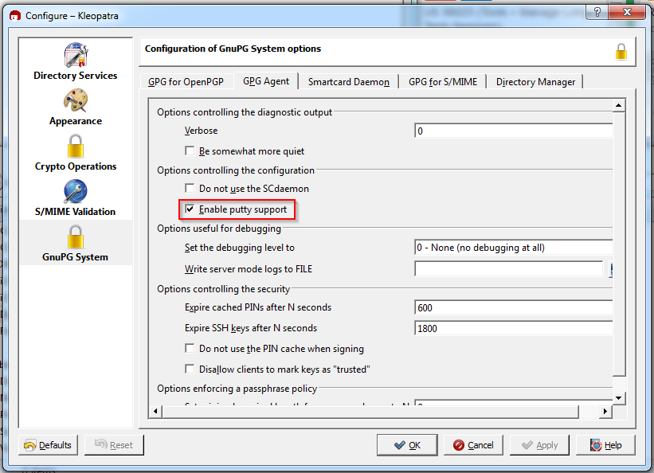
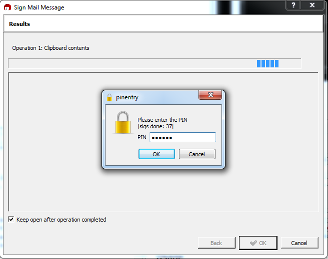
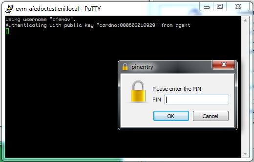
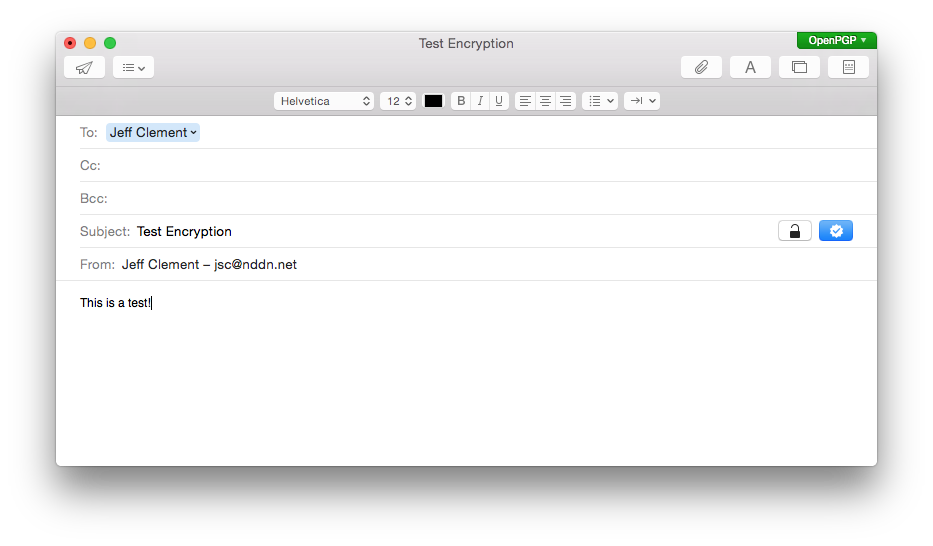

I use SSH daily (with SSH keys) and would like to use GPG routinely (if only people I conversed with would use it) but key management is always a problem.  I don't like that I'm leaving secret keys on my work computer, work laptop, various home computers, etc.  To mitigate this problem I use a strong password on each of these keys which makes actually using them annoying.

Enter [smart cards](http://en.wikipedia.org/wiki/Smart_card)...  

Smart cards let you store the RSA private key information on a tamper resistant piece of hardware instead of scattered across various computers (where it can be accessed by other users of the machine, malicious software, etc).  Software can ask the smart card to perform cryptographic operations on its behalf without disclosing the key to the computer (in fact, there is no reasonable way to extract the private key from a smart card).  To prevent unauthorized use the smart code requires the user provide a PIN.  If the PIN is entered incorrectly three times the card is blocked and must be reset using the administrative PIN.  If the administrative PIN is entered incorrectly the card is rendered inoperable.  The smart cards significantly increase the security of my keys and don't require me to use long passwords to secure my GPG/SSH keys on my individual machines. 

Unfortunately, despite existing for over a decade, it's been difficult to find comprehensive information about setting up and using smart cards, for use with GPG and SSH, under Linux, Windows and OSX.

<div class="note">This article is heavily based on "[Offline GnuPG Master Key and Subkeys on YubiKey NEO Smartcard](http://blog.josefsson.org/2014/06/23/offline-gnupg-master-key-and-subkeys-on-yubikey-neo-smartcard/)" by 
Simon Josefsson.  Much like the reason Simon wrote his post, this article was primarily created to document my setup for my future reference.</div>

Roughly:

* 4096-bit Master GnuPG key is generated and stored on an offline computer
* Master key is used for key signing and updating expiry dates on my keys (rarely)
* 2048-bit Sub-keys for encryption, signing and authentication are created and stored on Yubikey NEO for daily use
* I have a mix of Windows, OSX and Linux machines I want to use with this
* I want to use the smart card for GnuPG (encryption / signing) and SSH (remote login)

# Required Hardware



For day-to-day use I chose the [Yubikey Neo](https://www.yubico.com/products/yubikey-hardware/yubikey-neo/).  I've LOVED the Yubikey product line for years because they are clever, small, versatile, and indestructible.  I bought mine from [Amazon for $60](http://www.amazon.ca/dp/B00LX8KZZ8).  They support various OTP schemes, OpenPGP smart card, and [Fido U2F](https://fidoalliance.org/specs/fido-u2f-overview-v1.0-rd-20140209.pdf). The downside is that there is no on-device PIN entry mechanism so you rely on a software PIN which is susceptible to key logging.  Another potential downside is that the NEO only supports 2048-bit RSA keys although those are [still acceptably strong](https://www.digicert.com/TimeTravel/math.htm).  Yubico does have a good article about [2048-bit vs 4096-bit keys](https://www.yubico.com/2015/02/big-debate-2048-4096-yubicos-stand/) that you should read.

Another option is to buy a dedicated [OpenPGP smart card](http://g10code.com/p-card.html) from [Kernel Concepts](http://shop.kernelconcepts.de/).  The advantage here is that you have the option of using a smart card reader with a hardware keypad which mitigates much of the PIN key logging issue the NEO is susceptible to.  The OpenPGP Smart Card V2.1 also supports 4096-bit RSA keys. Unfortunately this card also requires a separate reader and an additional driver on Windows where the NEO doesn't.  It's also more fragile than the almost indestructible Yubikey. 

Other than a few Yubikey specific setup steps (below) the process for both devices is the same.

## Enabling OpenPGP on Yubikey

If you are using a Yubikey Neo for your smart card you'll need to enable CCID mode and, while you are at it, enable Fido U2F mode.   

For simultaneous OTP, CCID and U2F you need firmware 3.3.0 or higher.

Use the [Yubikey Neo Manager](https://developers.yubico.com/yubikey-neo-manager/Releases/) (I used 1.2.1) to verify your Yubikey firmware version and to enable OTP+CCID+U2F.

I did this on Windows because it was convenient but there are packages for OSX and Linux too.  There is also the *ykpersonalize* CLI tool that can do this.



# Setup
## Setting up the air-gapped machine

I chose to generate my GPG keys on an air-gapped (non-network connected) Debian LiveCD to prevent any accidental leakage of my keys.  Once the keys are generated I copy them onto backup media (multiple backup media) and then load the daily-use subkeys onto my smart card for daily use.  

Download Debian Live install image from [here](https://www.debian.org/CD/live/) (I used 7.8.0-amd64-standard) and install on USB thumb-drive using a method appropriate for your OS of choice.

Boot the Live CD and attach it to the network.

Install additional dependencies on the machine:

```sh
$ sudo apt-get install haveged gnupg2 gnupg-agent libpth20 pinentry-curses libccid pcscd scdaemon libksba8
```

<div class="warning"><p>To work with the Yubikey you must have gnupg2 &gt;= 2.0.22 and scdaemon &gt;= 2.0.22</p><p> If you are using Debian Wheezy you can install updated version of gnupg2 and scdaemon from backports with: <pre>
$ echo "deb http://http.debian.net/debian wheezy-backports main" >> /etc/apt/sources.list
$ apt-get update
$ apt-get -t wheezy-backports install gnugp2 scdaemon
</pre></div>

<div class="note">haveged is an entropy harvesting daemon that is installed to help improve the entropy in the entropy pool and speed up key generation.</div>

Configure GnuPG with safer defaults and stronger default ciphers (from [riseup.net](https://help.riseup.net/en/security/message-security/openpgp/best-practices)):

```sh
$ mkdir ~/.gnupg
$ cat > ~/.gnupg/gpg.conf << !
no-emit-version
no-comments
keyid-format 0xlong
with-fingerprint
use-agent
personal-cipher-preferences AES256 AES192 AES CAST5
personal-digest-preferences SHA512 SHA384 SHA256 SHA224
cert-digest-algo SHA512
default-preference-list SHA512 SHA384 SHA256 SHA224 AES256 AES192 AES CAST5 ZLIB BZIP2 ZIP Uncompressed
!
```

<div class="danger">Unplug your network cable now and verify that machine no longer has network connectivity.</div>

<div class="note">Most of the rest of this guide should be run as root.  The default permissions on the Yubikey device under the Debian LiveCD don't allow non-root users to interact with it.  We could fix it but this is a LiveCD and it won't survive the reboot so life is simpler just doing the key generation and key-to-card operations as root.</div>

## Generating the GPG keys

Here is a sample of the keys that I'm trying to generate.  The master key is reserved for key signing and certifying the sub-keys.  There are distinct sub-keys for signing, encryption and authentication (SSH).

```
pub  4096R/0x2896DB4A0E427716  created: 2015-04-15  expires: 2016-04-14  usage: SC  
                               trust: ultimate      validity: ultimate
sub  2048R/0x770A210849C9CBD7  created: 2015-04-15  expires: 2015-10-12  usage: S   
sub  2048R/0x6BF07F7DA7D84FFD  created: 2015-04-15  expires: 2015-10-12  usage: E   
sub  2048R/0x7B13B2E1879F1ED3  created: 2015-04-15  expires: 2015-10-12  usage: A   
[ultimate] (1). Test User <test@test.com>
[ultimate] (2)  Test User <test@megatestcorp.ca>
[ultimate] (3)  Test User <test@keybase.io>
```

Start by creating the master key.  I chose a 4096-bit key length for this and set an expiry of one year.  I could be convinced I should put that further in the future but then I'll forget about updating it.  An expiry date is important so that if I lose my key it doesn't hang around on the key servers indefinitely.

```
$ gpg2 --gen-key
gpg (GnuPG) 2.0.19; Copyright (C) 2012 Free Software Foundation, Inc.
This is free software: you are free to change and redistribute it.
There is NO WARRANTY, to the extent permitted by law.

gpg: keyring `/home/user/.gnupg/secring.gpg' created
Please select what kind of key you want:
   (1) RSA and RSA (default)
   (2) DSA and Elgamal
   (3) DSA (sign only)
   (4) RSA (sign only)
Your selection? 4
RSA keys may be between 1024 and 4096 bits long.
What keysize do you want? (2048) 4096
Requested keysize is 4096 bits
Please specify how long the key should be valid.
         0 = key does not expire
      <n>  = key expires in n days
      <n>w = key expires in n weeks
      <n>m = key expires in n months
      <n>y = key expires in n years
Key is valid for? (0) 1y
Key expires at Thu 14 Apr 2016 11:49:51 AM UTC
Is this correct? (y/N) y

You need a user ID to identify your key; the software constructs the user ID
from the Real Name, Comment and Email Address in this form:
    "Heinrich Heine (Der Dichter) <heinrichh@duesseldorf.de>"

Real name: Test User
Email address: test@test.com
Comment: 
You selected this USER-ID:
    "Test User <test@test.com>"

Change (N)ame, (C)omment, (E)mail or (O)kay/(Q)uit? o
You need a Passphrase to protect your secret key.

We need to generate a lot of random bytes. It is a good idea to perform
some other action (type on the keyboard, move the mouse, utilize the
disks) during the prime generation; this gives the random number
generator a better chance to gain enough entropy.
+++++
.................+++++
gpg: key 0x2896DB4A0E427716 marked as ultimately trusted
public and secret key created and signed.

gpg: checking the trustdb
gpg: 3 marginal(s) needed, 1 complete(s) needed, PGP trust model
gpg: depth: 0  valid:   1  signed:   0  trust: 0-, 0q, 0n, 0m, 0f, 1u
gpg: next trustdb check due at 2016-04-14
pub   4096R/0x2896DB4A0E427716 2015-04-15 [expires: 2016-04-14]
      Key fingerprint = E397 DF19 074B 0A37 FC4F  B4E5 2896 DB4A 0E42 7716
uid                            Test User <test@test.com>

Note that this key cannot be used for encryption.  You may want to use
the command "--edit-key" to generate a subkey for this purpose.
```

Edit the key and add additional UIDs (e-mail addresses) and a photo (optional).

```
gpg2 --edit-key 0x2896DB4A0E427716
gpg (GnuPG) 2.0.19; Copyright (C) 2012 Free Software Foundation, Inc.
This is free software: you are free to change and redistribute it.
There is NO WARRANTY, to the extent permitted by law.

Secret key is available.

pub  4096R/0x2896DB4A0E427716  created: 2015-04-15  expires: 2016-04-14  usage: SC  
                               trust: ultimate      validity: ultimate
[ultimate] (1). Test User <test@test.com>

gpg> adduid
Real name: Test User
Email address: test@megatestcorp.ca
Comment: 
You selected this USER-ID:
    "Test User <test@megatestcorp.ca>"

Change (N)ame, (C)omment, (E)mail or (O)kay/(Q)uit? o

You need a passphrase to unlock the secret key for
user: "Test User <test@test.com>"
4096-bit RSA key, ID 0x2896DB4A0E427716, created 2015-04-15


pub  4096R/0x2896DB4A0E427716  created: 2015-04-15  expires: 2016-04-14  usage: SC  
                               trust: ultimate      validity: ultimate
[ultimate] (1)  Test User <test@test.com>
[ unknown] (2). Test User <test@megatestcorp.ca>

gpg> adduid
Real name: Test User
Email address: test@keybase.io
Comment: 
You selected this USER-ID:
    "Test User <test@keybase.io>"

Change (N)ame, (C)omment, (E)mail or (O)kay/(Q)uit? o

You need a passphrase to unlock the secret key for
user: "Test User <test@test.com>"
4096-bit RSA key, ID 0x2896DB4A0E427716, created 2015-04-15


pub  4096R/0x2896DB4A0E427716  created: 2015-04-15  expires: 2016-04-14  usage: SC  
                               trust: ultimate      validity: ultimate
[ultimate] (1)  Test User <test@test.com>
[ unknown] (2)  Test User <test@megatestcorp.ca>
[ unknown] (3). Test User <test@keybase.io>

gpg> uid 1

pub  4096R/0x2896DB4A0E427716  created: 2015-04-15  expires: 2016-04-14  usage: SC  
                               trust: ultimate      validity: ultimate
[ultimate] (1)* Test User <test@test.com>
[ unknown] (2)  Test User <test@megatestcorp.ca>
[ unknown] (3). Test User <test@keybase.io>

gpg> primary

You need a passphrase to unlock the secret key for
user: "Test User <test@test.com>"
4096-bit RSA key, ID 0x2896DB4A0E427716, created 2015-04-15


pub  4096R/0x2896DB4A0E427716  created: 2015-04-15  expires: 2016-04-14  usage: SC  
                               trust: ultimate      validity: ultimate
[ultimate] (1)* Test User <test@test.com>
[ unknown] (2)  Test User <test@megatestcorp.ca>
[ unknown] (3)  Test User <test@keybase.io>

gpg> save
```

Now generate the sub-keys that will be pushed onto the smart card.  I've chosen 2048-bit keys because that's the largest keysize supported by the Yubikey NEO.  The OpenPGP Smart Card V2.1 does support 4096-bit RSA keys so depending on your hardware...  

```
gpg2 --expert --edit-key 0x2896DB4A0E427716
gpg (GnuPG) 2.0.19; Copyright (C) 2012 Free Software Foundation, Inc.
This is free software: you are free to change and redistribute it.
There is NO WARRANTY, to the extent permitted by law.

Secret key is available.

pub  4096R/0x2896DB4A0E427716  created: 2015-04-15  expires: 2016-04-14  usage: SC  
                               trust: ultimate      validity: ultimate
[ultimate] (1). Test User <test@test.com>
[ultimate] (2)  Test User <test@megatestcorp.ca>
[ultimate] (3)  Test User <test@keybase.io>

gpg> addkey
Key is protected.

You need a passphrase to unlock the secret key for
user: "Test User <test@test.com>"
4096-bit RSA key, ID 0x2896DB4A0E427716, created 2015-04-15

Please select what kind of key you want:
   (3) DSA (sign only)
   (4) RSA (sign only)
   (5) Elgamal (encrypt only)
   (6) RSA (encrypt only)
   (7) DSA (set your own capabilities)
   (8) RSA (set your own capabilities)
Your selection? 4
RSA keys may be between 1024 and 4096 bits long.
What keysize do you want? (2048) 
Requested keysize is 2048 bits
Please specify how long the key should be valid.
         0 = key does not expire
      <n>  = key expires in n days
      <n>w = key expires in n weeks
      <n>m = key expires in n months
      <n>y = key expires in n years
Key is valid for? (0) 6m
Key expires at Mon 12 Oct 2015 12:05:23 PM UTC
Is this correct? (y/N) y
Really create? (y/N) y
We need to generate a lot of random bytes. It is a good idea to perform
some other action (type on the keyboard, move the mouse, utilize the
disks) during the prime generation; this gives the random number
generator a better chance to gain enough entropy.

pub  4096R/0x2896DB4A0E427716  created: 2015-04-15  expires: 2016-04-14  usage: SC  
                               trust: ultimate      validity: ultimate
sub  2048R/0x770A210849C9CBD7  created: 2015-04-15  expires: 2015-10-12  usage: S   
[ultimate] (1). Test User <test@test.com>
[ultimate] (2)  Test User <test@megatestcorp.ca>
[ultimate] (3)  Test User <test@keybase.io>

gpg> addkey
Key is protected.

You need a passphrase to unlock the secret key for
user: "Test User <test@test.com>"
4096-bit RSA key, ID 0x2896DB4A0E427716, created 2015-04-15

Please select what kind of key you want:
   (3) DSA (sign only)
   (4) RSA (sign only)
   (5) Elgamal (encrypt only)
   (6) RSA (encrypt only)
   (7) DSA (set your own capabilities)
   (8) RSA (set your own capabilities)
Your selection? 6
RSA keys may be between 1024 and 4096 bits long.
What keysize do you want? (2048) 
Requested keysize is 2048 bits
Please specify how long the key should be valid.
         0 = key does not expire
      <n>  = key expires in n days
      <n>w = key expires in n weeks
      <n>m = key expires in n months
      <n>y = key expires in n years
Key is valid for? (0) 6m
Key expires at Mon 12 Oct 2015 12:05:50 PM UTC
Is this correct? (y/N) y
Really create? (y/N) y
We need to generate a lot of random bytes. It is a good idea to perform
some other action (type on the keyboard, move the mouse, utilize the
disks) during the prime generation; this gives the random number
generator a better chance to gain enough entropy.

pub  4096R/0x2896DB4A0E427716  created: 2015-04-15  expires: 2016-04-14  usage: SC  
                               trust: ultimate      validity: ultimate
sub  2048R/0x770A210849C9CBD7  created: 2015-04-15  expires: 2015-10-12  usage: S   
sub  2048R/0x6BF07F7DA7D84FFD  created: 2015-04-15  expires: 2015-10-12  usage: E   
[ultimate] (1). Test User <test@test.com>
[ultimate] (2)  Test User <test@megatestcorp.ca>
[ultimate] (3)  Test User <test@keybase.io>

gpg> addkey
Key is protected.

You need a passphrase to unlock the secret key for
user: "Test User <test@test.com>"
4096-bit RSA key, ID 0x2896DB4A0E427716, created 2015-04-15

Please select what kind of key you want:
   (3) DSA (sign only)
   (4) RSA (sign only)
   (5) Elgamal (encrypt only)
   (6) RSA (encrypt only)
   (7) DSA (set your own capabilities)
   (8) RSA (set your own capabilities)
Your selection? 8

Possible actions for a RSA key: Sign Encrypt Authenticate 
Current allowed actions: Sign Encrypt 

   (S) Toggle the sign capability
   (E) Toggle the encrypt capability
   (A) Toggle the authenticate capability
   (Q) Finished

Your selection? s

Possible actions for a RSA key: Sign Encrypt Authenticate 
Current allowed actions: Encrypt 

   (S) Toggle the sign capability
   (E) Toggle the encrypt capability
   (A) Toggle the authenticate capability
   (Q) Finished

Your selection? e

Possible actions for a RSA key: Sign Encrypt Authenticate 
Current allowed actions: 

   (S) Toggle the sign capability
   (E) Toggle the encrypt capability
   (A) Toggle the authenticate capability
   (Q) Finished

Your selection? a

Possible actions for a RSA key: Sign Encrypt Authenticate 
Current allowed actions: Authenticate 

   (S) Toggle the sign capability
   (E) Toggle the encrypt capability
   (A) Toggle the authenticate capability
   (Q) Finished

Your selection? q
RSA keys may be between 1024 and 4096 bits long.
What keysize do you want? (2048) 
Requested keysize is 2048 bits
Please specify how long the key should be valid.
         0 = key does not expire
      <n>  = key expires in n days
      <n>w = key expires in n weeks
      <n>m = key expires in n months
      <n>y = key expires in n years
Key is valid for? (0) 6m
Key expires at Mon 12 Oct 2015 12:06:18 PM UTC
Is this correct? (y/N) y
Really create? (y/N) y
We need to generate a lot of random bytes. It is a good idea to perform
some other action (type on the keyboard, move the mouse, utilize the
disks) during the prime generation; this gives the random number
generator a better chance to gain enough entropy.

pub  4096R/0x2896DB4A0E427716  created: 2015-04-15  expires: 2016-04-14  usage: SC  
                               trust: ultimate      validity: ultimate
sub  2048R/0x770A210849C9CBD7  created: 2015-04-15  expires: 2015-10-12  usage: S   
sub  2048R/0x6BF07F7DA7D84FFD  created: 2015-04-15  expires: 2015-10-12  usage: E   
sub  2048R/0x7B13B2E1879F1ED3  created: 2015-04-15  expires: 2015-10-12  usage: A   
[ultimate] (1). Test User <test@test.com>
[ultimate] (2)  Test User <test@megatestcorp.ca>
[ultimate] (3)  Test User <test@keybase.io>

gpg> save
```

Generate a revocation certificate in case this key is lost or compromised.  It's probably worth actually printing this and sticking it somewhere safe in addition to storing a electronic version.

```
$ gpg2 --gen-revoke 0x2896DB4A0E427716
sec  4096R/0x2896DB4A0E427716 2015-04-15 Test User <test@test.com>

Create a revocation certificate for this key? (y/N) y
Please select the reason for the revocation:
  0 = No reason specified
  1 = Key has been compromised
  2 = Key is superseded
  3 = Key is no longer used
  Q = Cancel
(Probably you want to select 1 here)
Your decision? 1
Enter an optional description; end it with an empty line:
> 
Reason for revocation: Key has been compromised
(No description given)
Is this okay? (y/N) y

You need a passphrase to unlock the secret key for
user: "Test User <test@test.com>"
4096-bit RSA key, ID 0x2896DB4A0E427716, created 2015-04-15

ASCII armored output forced.
Revocation certificate created.

Please move it to a medium which you can hide away; if Mallory gets
access to this certificate he can use it to make your key unusable.
It is smart to print this certificate and store it away, just in case
your media become unreadable.  But have some caution:  The print system of
your machine might store the data and make it available to others!
-----BEGIN PGP PUBLIC KEY BLOCK-----
Comment: A revocation certificate should follow

iQIfBCABCgAJBQJVLlD8Ah0CAAoJECiW20oOQncWQk0QAKofL48WIppMMbu9YLWS
aEIqg0AEVxBsVY6jk5+1IFByTulfkrf5ew4tbIJOuIjp0sIjfy4VXjWOqyw4peWS
OV9/N1JNxaQ8SjsmeiDycxEhLT3F6IUBiJ377NIgiAQ9BrYnqBdOekVxv0mjYEda
tLv0/vjfmum45q1ZLiQnOB3r8mK5nIqoky0Y/UhYZDtrM6b+Csk5+HEl0HZx7cKM
0lwF3ccEbsUcLIngyqj5J+5AUaePkszOwZuvrqdd+AslekC4f3LbKXfKa7K42H4h
9cVxBLxv320Bizo+0iBhCetraXmkv8A+f9AK6e26QLziKj16RrOf22d1MrYan4CX
+6JE+6l6ScgmhwX+UpeYwX8zAsr7f/jILKTVlbNb0jYUFFLw+pMZcohDOx+RS0ed
esWjXVBm/0+mFJLZoJLQj4AgraSBVXa8x8SD+TX7RKEKxhmJfaLC0WiAg4SSA9Kv
h93wgaP4z2/s2AJarZk81XyzILVGIh3tjfww93/myce+PxXHDVc+YTD1D4kEcJL2
KUZCcnennpnRVS3M+PqKryF6ZXMVgG79N4ia50owUeDzwxJOW2MokL0TRB0A1OEo
1CuNivzQkyvx+ywQa3nLeTrd7fJu9+tmYOTwuRk1m9gZ3IEeUJkK8bfntsOKK9XT
gY2OYVpEhMQ4Kblpx03YX25U
=j75h
-----END PGP PUBLIC KEY BLOCK-----
```

Now **backup** the GPG keys on a separate USB stick (actually make two copies).

The easy option is backup the whole .gnupg folder with tar <kbd>tar -czf gnupg-backup.tgz ~/.gnupg</kbd>.  Assuming I've mounted a USB stick under */media/BACKUP* the following would work:

```sh
$ tar -czf /media/BACKUP/gnupg.tgz ~/.gnupg
$ gpg2 -a --export-secret-key  0x2896DB4A0E427716 >> /media/BACKUP/2896DB4A0E427716.master.key
$ gpg2 -a --export-secret-subkeys  0x2896DB4A0E427716 >> /media/BACKUP/2896DB4A0E427716.sub.key
```

<div class="danger">
Be absolutely sure you have a backup of your GPG keys and revocation certificate on a separate USB stick before you continue.  Remember this is a LiveCD and any work you do on this environment is erased upon reboot.  This backup is necessary for several reasons:
<ol>
 <li>If your smart card is lost or damaged you can create a new one and (optionally) revoke the sub-keys that were in use on the previous card.
 <li>The sub-keys on the smart card are limited and can not sign other keys, change your expiry date, or add UIDs to your existing key
</ol>
</div>


## Configuring the smart card

Use <kbd>gpg2 --card-edit</kbd> to edit the user information and PINs for the smart card.

* **User PIN** - this is the PIN required to use your key to sign/decrypt
* **Admin PIN** - this PIN is required to make changes to the smart card and is not used day-to-day
* **URL** - this is the location of your public key file and can be used my GnuPG to download your key in new installations.  I really like <a href="https://keybase.io">keybase.io</a> so I've used that.

<div class="note">My environment uses the graphical PIN entry program so you don't see PIN prompts below but you will be prompted after many of the operations for a PIN.</div>

<div class="note">The default admin PIN is usually '12345678' and the default PIN is usually '123456'.</div>

```
$ gpg2 --card-edit

Application ID ...: D2760001240102000006030189290000
Version ..........: 2.0
Manufacturer .....: Yubico
Serial number ....: 03018929
Name of cardholder: 
Language prefs ...: en
Sex ..............: 
URL of public key : 
Login data .......: NA
Signature PIN ....: forced
Key attributes ...: 2048R 2048R 2048R
Max. PIN lengths .: 127 127 127
PIN retry counter : 3 3 3
Signature counter : 0
Signature key ....: 
Encryption key....: 
Authentication key: 
General key info..: [none]

gpg/card> admin
Admin commands are allowed

gpg/card> passwd
gpg: OpenPGP card no. D2760001240102000006030189290000 detected

1 - change PIN
2 - unblock PIN
3 - change Admin PIN
4 - set the Reset Code
Q - quit

Your selection? 1
PIN changed.

1 - change PIN
2 - unblock PIN
3 - change Admin PIN
4 - set the Reset Code
Q - quit

Your selection? 3
PIN changed.

1 - change PIN
2 - unblock PIN
3 - change Admin PIN
4 - set the Reset Code
Q - quit

Your selection? url

1 - change PIN
2 - unblock PIN
3 - change Admin PIN
4 - set the Reset Code
Q - quit

Your selection? q

gpg/card> url
URL to retrieve public key: https://keybase.io/user/key.asc

gpg/card> name
Cardholder's surname: User
Cardholder's given name: Test

gpg/card> login
Login data (account name): test

gpg/card> sex
Sex ((M)ale, (F)emale or space): M

gpg/card> lang
Language preferences: en

gpg/card> list

Application ID ...: D2760001240102000006030189290000
Version ..........: 2.0
Manufacturer .....: Yubico
Serial number ....: 03018929
Name of cardholder: Test User
Language prefs ...: en
Sex ..............: male
URL of public key : https://keybase.io/user/key.asc
Login data .......: test
Signature PIN ....: forced
Key attributes ...: 2048R 2048R 2048R
Max. PIN lengths .: 127 127 127
PIN retry counter : 3 3 3
Signature counter : 0
Signature key ....: 
Encryption key....: 
Authentication key: 
General key info..: [none]

gpg/card> quit
```

## Loading sub-keys onto the smart card

```
$ gpg2 --edit-key 0x2896DB4A0E427716

Secret key is available.

pub  4096R/0x2896DB4A0E427716  created: 2015-04-15  expires: 2016-04-14  usage: SC
                               trust: ultimate      validity: ultimate
sub  2048R/0x770A210849C9CBD7  created: 2015-04-15  expires: 2015-10-12  usage: S
sub  2048R/0x6BF07F7DA7D84FFD  created: 2015-04-15  expires: 2015-10-12  usage: E
sub  2048R/0x7B13B2E1879F1ED3  created: 2015-04-15  expires: 2015-10-12  usage: A
[ultimate] (1). Test User <test@test.com>
[ultimate] (2)  Test User <test@megatestcorp.ca>
[ultimate] (3)  Test User <test@keybase.io>

gpg> toggle

sec  4096R/0x2896DB4A0E427716  created: 2015-04-15  expires: 2016-04-14
ssb  2048R/0x770A210849C9CBD7  created: 2015-04-15  expires: never
ssb  2048R/0x6BF07F7DA7D84FFD  created: 2015-04-15  expires: never
ssb  2048R/0x7B13B2E1879F1ED3  created: 2015-04-15  expires: never
(1)  Test User <test@test.com>
(2)  Test User <test@megatestcorp.ca>
(3)  Test User <test@keybase.io>

gpg> key 1

sec  4096R/0x2896DB4A0E427716  created: 2015-04-15  expires: 2016-04-14
ssb* 2048R/0x770A210849C9CBD7  created: 2015-04-15  expires: never
ssb  2048R/0x6BF07F7DA7D84FFD  created: 2015-04-15  expires: never
ssb  2048R/0x7B13B2E1879F1ED3  created: 2015-04-15  expires: never
(1)  Test User <test@test.com>
(2)  Test User <test@megatestcorp.ca>
(3)  Test User <test@keybase.io>

gpg> keytocard
Signature key ....: FE6C F0EA CBCC 7EE7 4093  31FC 770A 2108 49C9 CBD7
Encryption key....: 61D4 690A B2FF DD1E BA20  7236 3F4C 28B7 720F 4E92
Authentication key: CB86 2306 2D78 9F11 3F40  BD12 7B13 B2E1 879F 1ED3

Please select where to store the key:
   (1) Signature key
   (3) Authentication key
Your selection? 1

You need a passphrase to unlock the secret key for
user: "Test User <test@test.com>"
2048-bit RSA key, ID 0x770A210849C9CBD7, created 2015-04-15


sec  4096R/0x2896DB4A0E427716  created: 2015-04-15  expires: 2016-04-14
ssb* 2048R/0x770A210849C9CBD7  created: 2015-04-15  expires: never
                     card-no: 0006 03018929
ssb  2048R/0x6BF07F7DA7D84FFD  created: 2015-04-15  expires: never
ssb  2048R/0x7B13B2E1879F1ED3  created: 2015-04-15  expires: never
(1)  Test User <test@test.com>
(2)  Test User <test@megatestcorp.ca>
(3)  Test User <test@keybase.io>

gpg> key 1

sec  4096R/0x2896DB4A0E427716  created: 2015-04-15  expires: 2016-04-14
ssb  2048R/0x770A210849C9CBD7  created: 2015-04-15  expires: never
                     card-no: 0006 03018929
ssb  2048R/0x6BF07F7DA7D84FFD  created: 2015-04-15  expires: never
ssb  2048R/0x7B13B2E1879F1ED3  created: 2015-04-15  expires: never
(1)  Test User <test@test.com>
(2)  Test User <test@megatestcorp.ca>
(3)  Test User <test@keybase.io>

gpg> key 2

sec  4096R/0x2896DB4A0E427716  created: 2015-04-15  expires: 2016-04-14
ssb  2048R/0x770A210849C9CBD7  created: 2015-04-15  expires: never
                     card-no: 0006 03018929
ssb* 2048R/0x6BF07F7DA7D84FFD  created: 2015-04-15  expires: never
ssb  2048R/0x7B13B2E1879F1ED3  created: 2015-04-15  expires: never
(1)  Test User <test@test.com>
(2)  Test User <test@megatestcorp.ca>
(3)  Test User <test@keybase.io>

gpg> keytocard
Signature key ....: FE6C F0EA CBCC 7EE7 4093  31FC 770A 2108 49C9 CBD7
Encryption key....: 61D4 690A B2FF DD1E BA20  7236 3F4C 28B7 720F 4E92
Authentication key: CB86 2306 2D78 9F11 3F40  BD12 7B13 B2E1 879F 1ED3

Please select where to store the key:
   (2) Encryption key
Your selection? 2

You need a passphrase to unlock the secret key for
user: "Test User <test@test.com>"
2048-bit RSA key, ID 0x6BF07F7DA7D84FFD, created 2015-04-15

gpg> key 2

sec  4096R/0x2896DB4A0E427716  created: 2015-04-15  expires: 2016-04-14
ssb  2048R/0x770A210849C9CBD7  created: 2015-04-15  expires: never
                     card-no: 0006 03018929
ssb  2048R/0x6BF07F7DA7D84FFD  created: 2015-04-15  expires: never
                     card-no: 0006 03018929
ssb  2048R/0x7B13B2E1879F1ED3  created: 2015-04-15  expires: never
(1)  Test User <test@test.com>
(2)  Test User <test@megatestcorp.ca>
(3)  Test User <test@keybase.io>

gpg> key 3

sec  4096R/0x2896DB4A0E427716  created: 2015-04-15  expires: 2016-04-14
ssb  2048R/0x770A210849C9CBD7  created: 2015-04-15  expires: never
                     card-no: 0006 03018929
ssb  2048R/0x6BF07F7DA7D84FFD  created: 2015-04-15  expires: never
                     card-no: 0006 03018929
ssb* 2048R/0x7B13B2E1879F1ED3  created: 2015-04-15  expires: never
(1)  Test User <test@test.com>
(2)  Test User <test@megatestcorp.ca>
(3)  Test User <test@keybase.io>

gpg> keytocard
Signature key ....: FE6C F0EA CBCC 7EE7 4093  31FC 770A 2108 49C9 CBD7
Encryption key....: 61D4 690A B2FF DD1E BA20  7236 3F4C 28B7 720F 4E92
Authentication key: CB86 2306 2D78 9F11 3F40  BD12 7B13 B2E1 879F 1ED3

Please select where to store the key:
   (3) Authentication key
Your selection? 3

You need a passphrase to unlock the secret key for
user: "Test User <test@test.com>"
2048-bit RSA key, ID 0x7B13B2E1879F1ED3, created 2015-04-15


sec  4096R/0x2896DB4A0E427716  created: 2015-04-15  expires: 2016-04-14
ssb  2048R/0x770A210849C9CBD7  created: 2015-04-15  expires: never
                     card-no: 0006 03018929
ssb  2048R/0x6BF07F7DA7D84FFD  created: 2015-04-15  expires: never
                     card-no: 0006 03018929
ssb* 2048R/0x7B13B2E1879F1ED3  created: 2015-04-15  expires: never
                     card-no: 0006 03018929
(1)  Test User <test@test.com>
(2)  Test User <test@megatestcorp.ca>
(3)  Test User <test@keybase.io>

gpg> save
```

## Extracting your SSH public key

Use GnuPG to export your public key in ascii-armoured format.  This can be safely distributed to others who want to communicate securely with you (after an out-of-band verification of the fingerprint of course).

```
$ gpg2 -a --export 0x2896DB4A0E427716 > 0x2896DB4A0E427716.asc
```

## Distributing your GPG public key

It's good to distribute your GPG public key so that people who want to get in touch with you, securely, have access to your key.

The traditional mechanism for sharing keys is through PGP key servers.  You can upload your key with <kbd>gpg2 --send-key 0x2896DB4A0E427716</kbd>.  Other users can then download your key using your ID (email) or your key ID - those users should then verify the key is yours by either (1) checking that key is signed by someone they trust or (2) verifying the fingerprint on the key.  There are many public key servers and they generally share keys so no need to push your key to more than one of them.

[keybase.io](https://keybase.io) is a great alternative to distributing GnuPG keys.  Instead of verifying the key through a web-of-trust or out-of-band fingerprint exchange you verify it by verifying publicly posted and signed statements of identity on various social platforms such as github, twitter, reddit, hacker news, etc.  This gives a good way of getting reasonable assurance that the key you receive belongs to the person that controls those accounts.  Currently keybase.io is in beta and is invite based.  I have spare invites so feel free to get in touch if this interests you.

# Usage

The smart card can now be used for encryption, signing and authentication (SSH).  The master key, however, is required for making changes to your key and signing other keys so you'll need to keep the LiveCD and USB key backup handy for those operations.

## Linux

Adjusting UDEV to allow non-root users to interact with the NEO.

### Required software

```sh
$ sudo apt-get install gnupg2 gnupg-agent libpth20 pinentry-curses libccid pcscd scdaemon libksba8
```

<div class="warning"><p>To work with the Yubikey you must have gnupg2 &gt;= 2.0.22 and scdaemon &gt;= 2.0.22</p><p> If you are using Debian Wheezy you can install updated version of gnupg2 and scdaemon from backports with: <pre>
$ echo "deb http://http.debian.net/debian wheezy-backports main" >> /etc/apt/sources.list
$ apt-get update
$ apt-get -t wheezy-backports install gnugp2 scdaemon
</pre></div>

### Outstanding issues

1. gnome-keychain is the bain of my existance...

## Windows
### Required software

Download and install [GPG4Win 2.2.4 or higher](http://www.gpg4win.org/download.html).  The default settings are fine.

If you are using the [OpenPGP smart card](http://g10code.com/p-card.html) you'll also need a [driver for Windows](http://www.mysmartlogon.com/openpgp-card-mini-driver/).

### Configuration

1. Open Kleopatra and import your public key
2. Enable "Enable putty support" in Kleopatra to allow the Smartcard to be used for SSH authentication.
   

### Usage

GnuPG just works...  For example using Kleopatra's "Sign from clipboard" looks like so:



Trying to login using SSH looks like this:

 

If the smart card isn't present then the above operations would fail immediately.

### Outstanding issues

#### SSH Authentication Fails

Sometimes GPG fails to recognize the smart card.  I'm not sure why this is happening but I can generally fix it by closing Kleopatra, killing the gpg-agent process, and restarting Kleopatra.

The following script has worked for me but screams THIS IS THE WRONG SOLUTION TO THIS PROBLEM!

```
taskkill /f /im kleopatra.exe
taskkill /f /im gpg-agent.exe
"C:\Program Files (x86)\GNU\GnuPG\kleopatra.exe"
```

## OSX
### Required software

Download and install [GPGTools](https://gpgtools.org/) (I installed GPG Suite Beta 6).

### Configuration

Make sure to load your public key into GPG and then link your keys to the smartcard.

```sh
$ gpg --import << public.key
$ gpg --card-status
```

GPGTools has very nice integration with Mail.App and everything just works.



Add the following to your *.bashrc* or *.zshrc* to pull in the gpg-agent environment variables when you open new terminals.  This is required for SSH from the CLI to work properly.

```bash
if [ -f "${HOME}/.gpg-agent-info" ]; then
     . "${HOME}/.gpg-agent-info"
       export GPG_AGENT_INFO
       export SSH_AUTH_SOCK
       export SSH_AGENT_PID
fi
```

The *.gnupg/gpg-agent.conf* should look something like this (the last two lines being very important):

```
no-emit-version
no-comments
keyid-format 0xlong
with-fingerprint
use-agent
personal-cipher-preferences AES256 AES192 AES CAST5
personal-digest-preferences SHA512 SHA384 SHA256 SHA224
cert-digest-algo SHA512
default-preference-list SHA512 SHA384 SHA256 SHA224 AES256 AES192 AES CAST5 ZLIB BZIP2 ZIP Uncompressed
pinentry-program /usr/local/MacGPG2/libexec/pinentry-mac.app/Contents/MacOS/pinentry-mac
default-cache-ttl 600
max-cache-ttl 7200
enable-ssh-support
write-env-file
```

# References

- [Offline GnuPG Master Key and Subkeys on YubiKey NEO Smartcard](http://blog.josefsson.org/2014/06/23/offline-gnupg-master-key-and-subkeys-on-yubikey-neo-smartcard/) - This post was my primary source for getting up and running with the Yubikey NEO and for structuring my sub-keys.  
