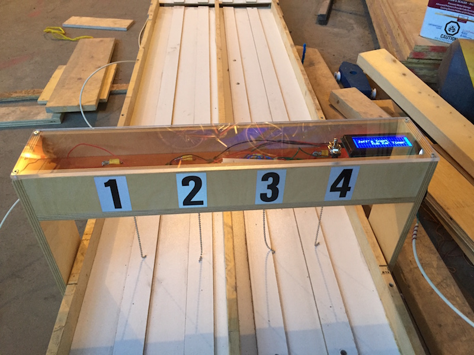
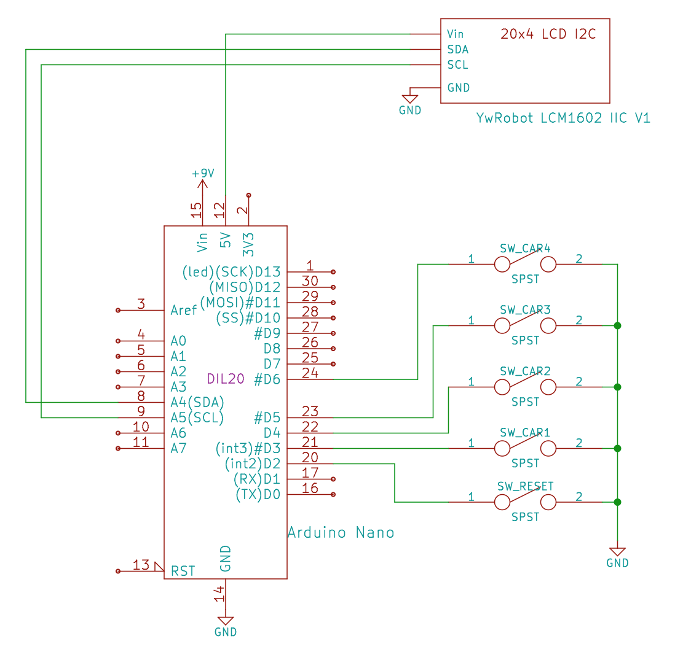
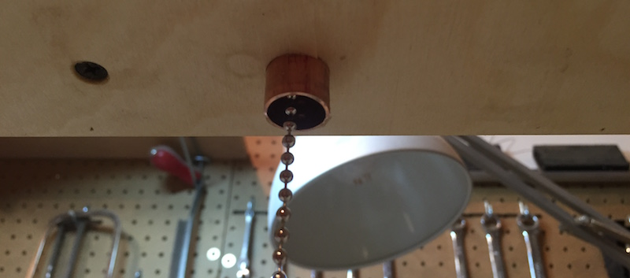
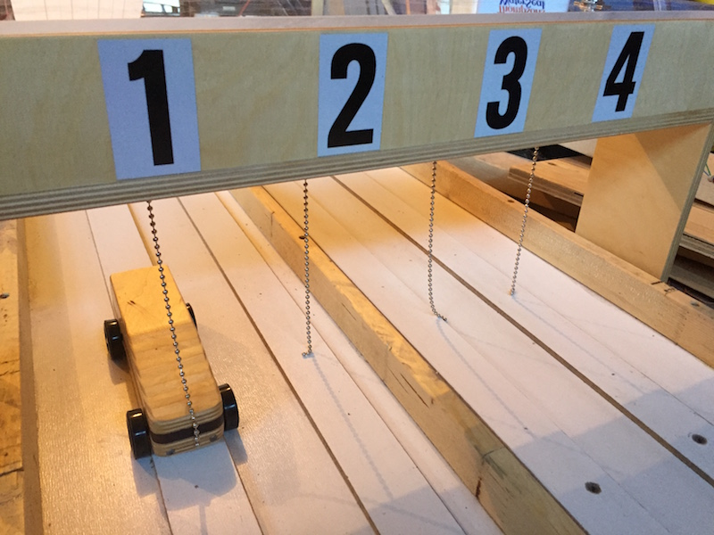

My boys are in Boy Scouts and the annual Kub Kar races are a big part of the program.   Our group has a couple older wooden tracks and I wanted to add a timer mechanism to them that would time and rank each car for each race.

I decided to build this based on the Arduino platform because I'm at lest somewhat familiar with it.

There are [companies that sell timers](http://www.besttrack.com/champ_timer.htm) but at $615 for a 4 track timer... Ouch!

## The Setup

All the input PINs (D 2,3,4,5,6) should have their internal pull-up enabled.

## The Trigger

The complicated part of this project is detecting cars as they pass through finish gate.  Typically this would be done optically with the car breaking a beam and that stopping the clock.  However, I finally got after this project with three days before the race.  I didn't have any lasers or photo-sensors handy so I took an alternative and mechanical approach.

I considered adding push buttons at the very end of the track but, given the speed some of the cars are going, I figured I'd either damage the buttons or the cars with that approach.

The premise for my final solution was to dangle a conductive "wire" (lamp pull chain) across the track and the car will push it into another conductor closing a circuit.  Because the switch isn't in charge of stopping the car I figured this would hold up to the abuse better.

I ended up drilling a 1/2" hole in the underside of the timing platform and insert a 1" section of 1/2" copper pipe.  Directly through the center I dangled a chunk of steel lamp pull-chain.  The copper tubes are all tied to ground and the chains are tied to the Arduino's digital IO pins (with internal pullup resistors enabled).

With this design it's important that the chain in each lane is a few links too long and dangles on the lane.  This prevents the chain from swinging back and forth for ages and allows you to get on with the next race much faster.

## The Display

If I were good at this type of thing I think the right displays would have been 4 big 7-segment displays for the placing, and then 4 multi-digit displays for the times.  Using big 7-segment displays would be nice because you can read them from far away.

I opted for a small 20x4 LCD I2C display because that's what I had handy.

## The Software

The source code for this entire project is up on [Bitbucket](https://bitbucket.org/jclement/kub-kar-timer).

## The Build

I built the track from 1/2" Baltic birch plywood.

The only real concerns are making sure it's wide enough to straddle the track and high-enough to allow verticals to pass underneath without incident.

To finish it off the top is covered with a piece of 1/4" Lexan to allow everyone to see the interesting bits instead.