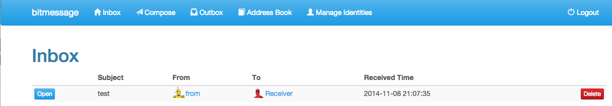

I've been "using" (by using I mean running and hoping somebody messages me) [bitmessage][bitmessage] for quite some time.  bitmessage is an anonymous messaging client that allows sending short messages securely and anonymously.

Unfortunately, bitmessage loses some utility for me because in order to use it you need to run the bitmessage client which I don't want to be copying amounst the various machines I use.  There are third party web services for bitmessage but most require you to trust that service which defeats the purpose of a system like bitmessage.

[bitmessage-web (on github)][web] is my attempt at building a self-hosted web-based bitmessage interface so that I can have one running instance of bitmessage and access my messages remotely by the web browser.  It's written in [node][node] and uses [angular][angular] and bootstrap and is intended to be responsive so works well on desktops and small devices.

[bitmessage]: http://bitmessage.org
[web]: http://github.com/jclement/bitmessage-web
[node]: http://nodejs.org
[angular]: http://angularjs.org
