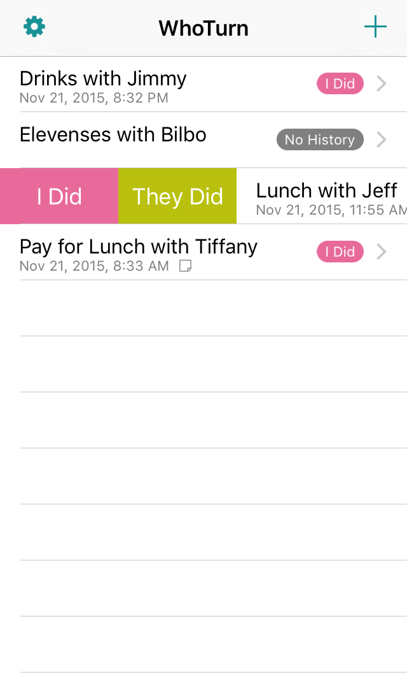

“Keep track of the deadbeats who owe you lunch.”

WhoTurn is a tool for those of us who have outsourced their longterm memory to their iPhone.  It tracks who paid last.

* Add things to track (ie. "Lunch with Joe")
* Track who paid last
* Delight in the fact that you now have one less thing to remember

That's it.

### Features

* Track an **unlimited** number of turn based things (ie. Lunch with Jimmy)
* Easily see the last time you did that thing and who paid
* Keep and view history
* Snappy sound effects to thrill you
* Settings page to turn off the sound effects once they cease to thrill you
* Spotlight integration
* Find out if your friends is a deadbeat

### Planned Features

* iCloud sync
* Per-person frequency with reminders if you're overdue for lunch

### Support

If you have questions, comments, suggestions, etc. please get in touch via. Twitter ([@WhoTurnApp](https://twitter.com/whoturnapp)) or by any of the messages on the [contact](/contact/) page.

### Credits

WhoTurn makes use of the following 3rd party libraries:

* [TDBadgedCell](http://www.tmdvs.me/TDBadgedCell/) - for nifty badges in the table cells
* [MGSwipeTableCell](https://github.com/MortimerGoro/MGSwipeTableCell) - for the swipe menu on the table cells